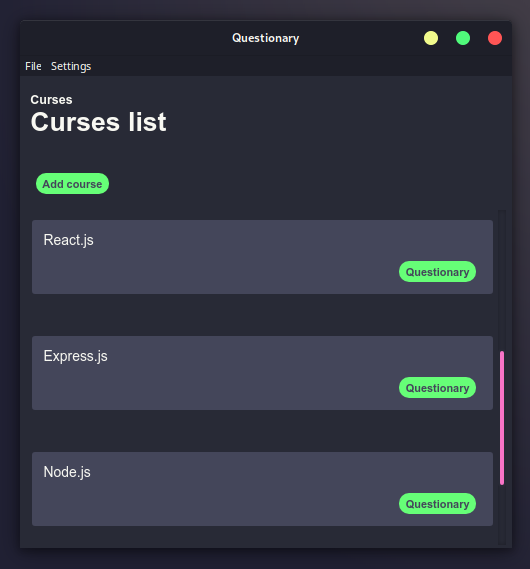
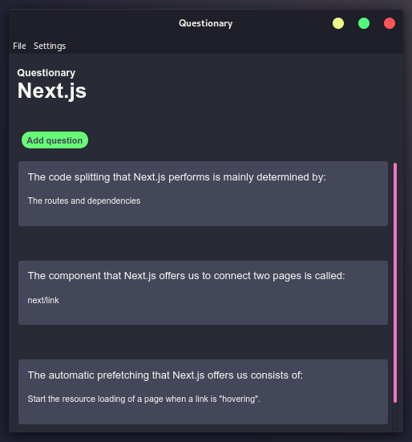
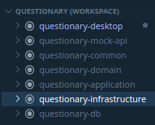

# Questionary

|  |  |
| :---------------------------------------------: | :--------------------------------------------: |
|                  List Courses                   |                  Questionary                   |

This application administer questionnaires of courses, it simply for notes of questionnaires. The main reason for this project was to learn more about a Clean Architecture using mainly TypeScript as a programming language.

## Structure

This is a mono repo that contains the following projects or folders:

|                          Structure                           | Description                                                  |
| :----------------------------------------------------------: | ------------------------------------------------------------ |
|  | *questionary-db*: Contains the sql dll file to create the database and the referential structure. *questionary-common:* They are definitions of contracts (interfaces) or common objects in the application that do not have to do with the logic of the business but rather with the structure of the application. *questionary-domain:* This project defines the application guidelines. It contains the contracts and definitions of the business entities. This layer does not depend on any specific implementation of a technology, it only depends on questionary-common. *questionary-application:* This is the implementation layer for the business rules defined by questionary-domain. It contains the Use Cases (Business Logic) and the Gateways (Adapters that expose the business logic). This project depends on a Dependency Injection gesture. Still, this layer is not interested in what technology the services will be exposed to or in which database the information will be stored. *questionary-infraestructure:* This layer implements the repository pattern, defines the referential data model, and exposes the application's services through a Rest API. In addition to depending on the questionary-domain and questionary-application, it also depends on an ORM technology, database and http server. *questionary-desktop:* This is a client that consumes the rest API. *questionary-mock-api*: This project is just an API mockup for testing. |

## Technologies used

* *questionary-application:*
  * Dependency Injection: tsyringe
* *questionary-infraestructure*:
  * *ORM*: Sequelize
  * *Database:* Postgresql
  * *Http Server:* Express
* *questionary-desktop:* The client uses the following technologies just to learn a little more about a desktop application with web technologies.
  * *Rendere Proces:* React.js, Styled-Components, Redux.
  * *Main Proces:* Electron.js

